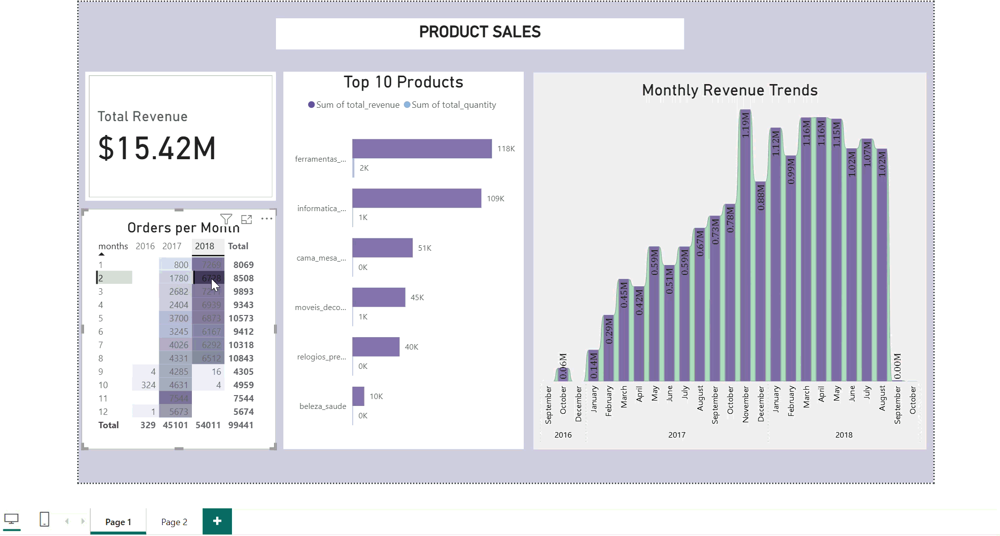
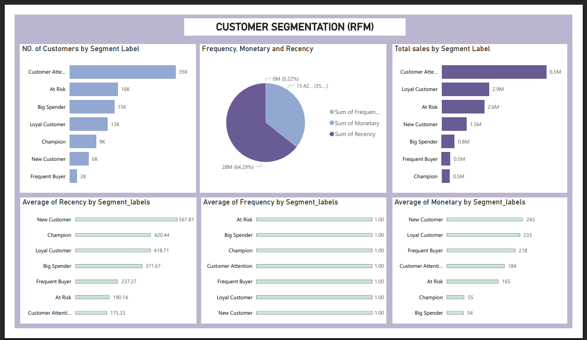

# Sales Insights and Customer Segmentation

## Table of Contents
1. [Project Summary](#Project-Summary)
2. [Tools and Technologies](#Used-Tools-and-Technologies-Used)
3. [Dataset](#Dataset)
4. [How to Use](#How-to-Use)
5. [SQL Analysis](#SQL-Analysis)
6. [Power BI Dashboard](#Power-BI-Dashboard)

# Project Summary
This project analyzes an [Kaggle E-Commerce Orders Data](#Dataset) to uncover business insights about sales, products, and customer behavior.  
The analysis was performed using **SQL** for querying and **Power BI** for interactive dashboards.

The main objectives were:

- Track sales trends and revenue growth over time

- Identify top-performing products

- Understand customer behavior using RFM (Recency, Frequency, Monetary segmentation)

Provide actionable insights for marketing and operations teams

# Tools and Technologies Used
- **SQL (MySQL)** → Data extraction, transformation, aggregations, sales iInsight and RFM analysis
- **Power BI Desktop** → Dashboards & visual storytelling  
- **GitHub** → Version control & portfolio sharing  

# Dataset
#### Link https://www.kaggle.com/datasets/sangamsharmait/ecommerce-orders-data-analysis

# How to Use
1. Clone the repository.

2. Import the dataset into MySQL.

3. Run the .sql scripts in the sql/ folder to reproduce analysis results.

4. Import the processed tables into Power BI Desktop.

5. Explore the dashboards in reports folder as pbix or download pdf (.pbix file or screenshots provided).

# SQL Analysis

### 1. Order & Sales Analysis (`sql/order_sales_analysis.sql`)
- Total orders per month  
- Total revenue (delivered orders only)  
- Monthly revenue trends  
- Top 10 best-selling products (by revenue & quantity)  

### 2. Customer Segmentation (`sql/RFM.sql`)
- Calculated Recency, Frequency, Monetary values  
- Assigned RFM scores (1–5) using **NTILE()**  
- Classified customers into groups:
  - Champions  
  - Loyal Customers  
  - At Risk
  - Frequent Buyer
  - Lost Customer
  - New Customers  
  - Big Spenders  
  - Customer Attention 

# Power BI Dashboard
<i>*** TO DOWNLOAD POWER BI DASHBORD PDF OR PBIX FILE *** (`./reports/Sales and RFM Analysis.pdf`) or (`./reports/Sales and RFM Analysis.pbix`)</i>

### 1. Product Sales & Trends

  -Total revenue overview
  -Orders per month
  -Top 10 products
  -Monthly revenue trends

### 2. Customer Segmentation

  -Distribution of customers by RFM segments
  -Total sales by segment
  -Average recency, frequency, and monetary values

